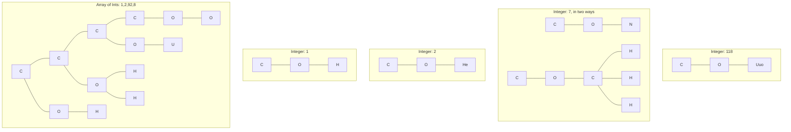
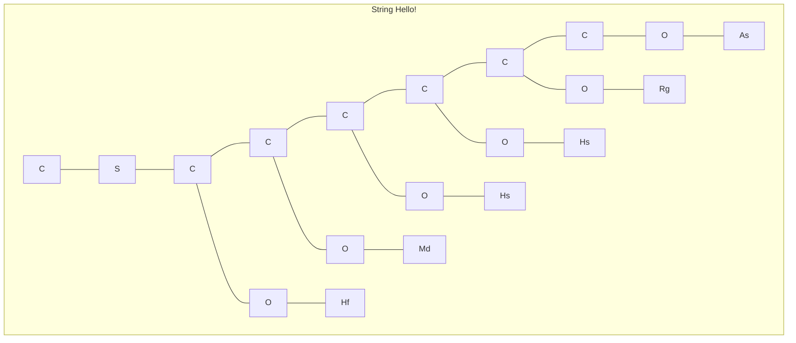

# Esoteric Reaction

Esoteric Reaction is a functional/stack-based/concatenative esoteric programming language where code is chemical equations.

## Goals

* Practice programming in Rust.
* Write an esolang that looks like chemical equations.

## Examples

### Hello World

```lisp
S"Hello World!" + heat -> S
; explanation
S"Hello World!" ; push string literal
+ heat          ; pop an element, output to STDOUT
-> S            ; conservation of mass
```

### Cat

```lisp
Li(light + heat) -> Li
; explanation
Li(            ; loop forever...
  light + heat ; push a line of STDIN, pop and output to STDOUT
)              ; end loop
-> Li          ; conservation of mass
```

## Programs

### Law of Conservation of Mass

All Esoteric Reaction programs must follow the Law of Conservation of Mass:
the number of atoms per element on the left side of the `->` must be equal to the number of atoms per element on the right side.

Note that this is conservation of *mass*, and not energy.

### Elements

All 118 known elements are reserved for built-ins.

#### Undiscovered Elements

All elements starting from atomic number 119 and beyond are available as bindable names.
The rules for what is considered an undiscovered element is as follows:

* The first character is uppercase, while all other characters are lowercase.
* When converting to an atomic number `x`, satisfies `x >= 119`.
* Only contains the following characters (from 0-9):
  * `nubtqphsoe`

To make a name of atomic number `N`, perform the following pseudocode:

```python
for each digit,
  map it to its letter value:
    n -> 0, u -> 1, b -> 2, t -> 3, q -> 4,
    p -> 5, h -> 6, s -> 7, o -> 8, e -> 9
capitalize the first letter.
```

#### Light and Heat

### Coefficients

### Subscripts

### Molecules

### Equations

### Naming Equations

```lisp
Uue: ... ; equation here
; usage
ABC + Uue -> AUue + BC ; use like any other element
```

## The Virtual Reaction Machine

The Virtual Reaction Machine is a virtual machine containing a stack of alkanes (acyclic chain/tree hydrocarbon).
These alkanes which are manipulated upon by the Esoteric Reaction program.
Each molecule can be read from, written to, modified, etc.
They form the basis of the data representation in Esoteric reaction.

<!-- TODO: Maybe limit reactions to fit octet rule? -->

### Alkanes

Alkanes are the core data structure of an Esoteric Reaction program.
Each carbon atom in the alkane can have 0-2 functional groups attached to it.
Empty bond locations on a carbon atom will be filled with filler hydrogen.
Alkanes can have new, empty carbon atoms attached anywhere.

### Alkane Length

Alkanes are their own arrays.
Each carbon atom can store 0-2 elements per atom, depending on the bonded functional groups.
The length of the longest chain of an alkane is its *capacity*;
it represents the half maximum number of functional groups that the alkene can hold.
You cannot attach more functional groups if there are no more empty hydrogens (i.e. fully saturated).

### Functional Groups

Functional groups change the properties of the alkane.
Functional groups with `R` take another functional group or alkane as an argument.

| Formula  | Name         | Verb        | Effect  | Notes                                                |
| -------- | ------------ | ----------- | ------- | ---------------------------------------------------- |
| `H`      | Hydride      | Hydrate     | -       | Does nothing.                                        |
| `OR`     | Alcohol      | Hydroxylate | Integer | The sum of atomic numbers of `R` is the actual data. |
| `B(OH)R` | Borinic Acid | Borinate    | Boolean | `true` if `R` is non-`H` or non-empty.               |
| `SR`     | Sulfide      | "Sulfate"?  | String  | `R` must be either a `H` or a hydroxylated alkane    |
|          |              |             |         |                                                      |
|          |              |             |         |                                                      |
|          |              |             |         |                                                      |

#### Functional Group Examples

"Empty" hydrogens are not shown.



```mermaid
graph TD
subgraph map1 [Map of Int-Bool: 1:true,2:false,92:false,8:true]
cm0[C] --- cm1[C] --- cm2[C] --- cm3[C] %% main chain
cm0 --- om0[O] --- hm0[H] %% 1:true
cm0 --- bm0[B] --- boh0[OH] & bh0[C]
cm1 --- om1[O] --- hm1[He] %% 2:false
cm1 --- bm1[B] --- boh1[OH]
cm2 --- om2[O] --- um2[U] %% 92:false
cm2 --- bm2[B] --- boh2[OH]
cm3 --- bm3[B] --- boh3[OH] & bh3[He]
cm3 --- om3[O] --- om32[O] %% 8:true
end
```


