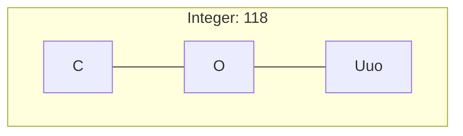
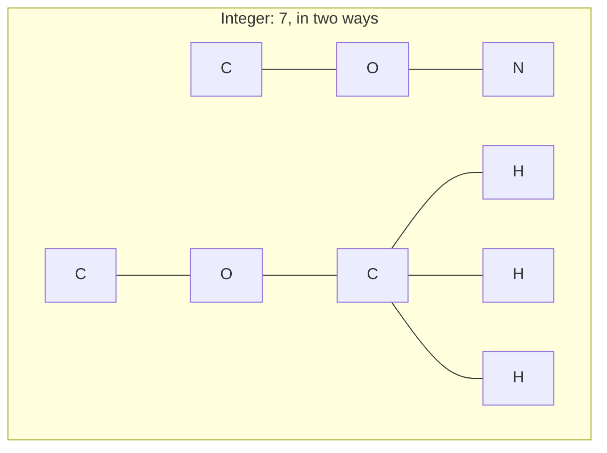
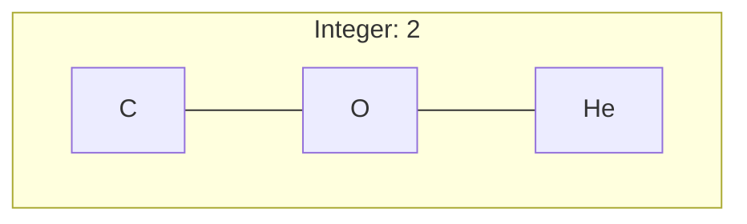
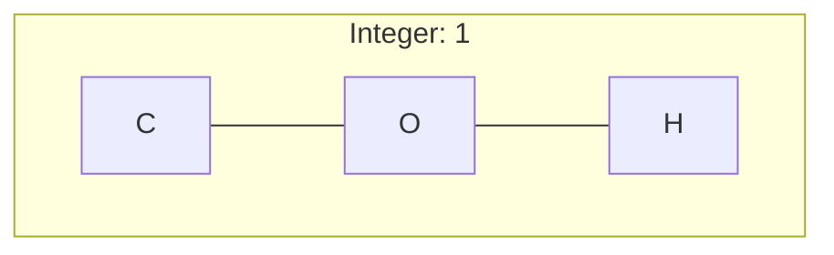
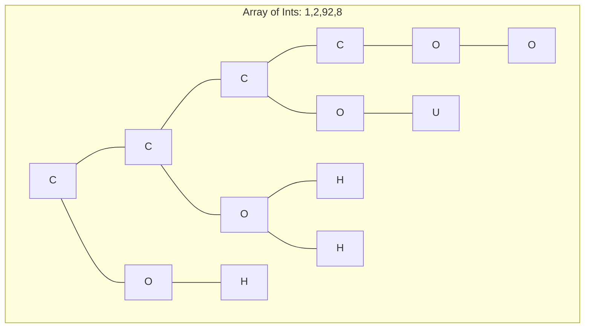
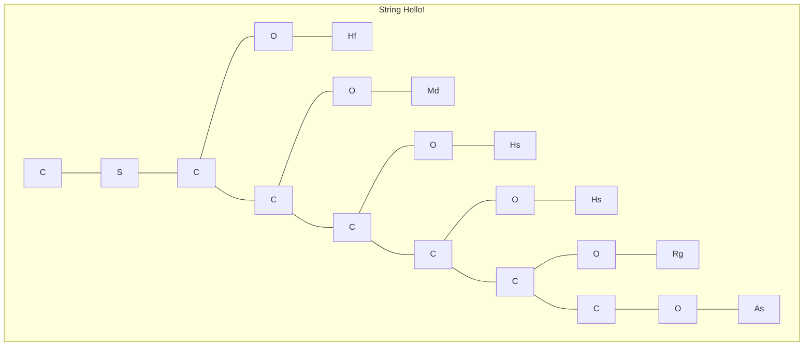

# Esoteric Reaction

Esoteric Reaction is a functional/stack-based/concatenative esoteric programming language where code is chemical equations.

## Goals

* Practice programming in Rust.
* Write an esolang that looks like chemical equations.

## The Virtual Reaction Machine

The Virtual Reaction Machine is a virtual machine containing a stack of alkanes (acyclic chain/tree hydrocarbon).
These alkanes which are manipulated upon by the Esoteric Reaction program.
Each molecule can be read from, written to, modified, etc.
They form the basis of the data representation in Esoteric reaction.

### Alkanes

Alkanes are the core data structure of an Esoteric Reaction program.
Each carbon atom in the alkane can have 0-2 functional groups attached to it.
Empty bond locations on a carbon atom will be filled with filler hydrogen.
Alkanes can have new, empty carbon atoms attached anywhere.

### Alkane Length

Alkanes are their own arrays and maps.
Each carbon atom can store 0-4 bonds per atom, depending on the bonded functional groups.
The length of the longest chain of an alkane is its *capacity*;
it represents the half maximum number of functional groups that the alkene can hold.
You cannot attach more functional groups if there are no more empty hydrogens (i.e. fully saturated).

### The Electron Rules: Octet Rule and Other Similar Rules

All bonds in the VRM must follow the octet rule, and other similar rules (duplet rule, 18-electron rule, here collectively called "electron rules") in order to be valid.
It is considered a runtime error if a molecule invalidates the electron rules.
Any empty bonds will be filled by a filler hydrogen.

### Functional Groups

Functional groups change the properties of the alkane.
In the table below, `R` represent sthe existing alkane chaine,
and `R'`, `R''`, `R'''`, etc., are other functional groups, or another alkane.

| Formula    | Name           | Effect  | Notes                                                      |
| ---------- | -------------- | ------- | ---------------------------------------------------------- |
| `RH`       | Hydride        | -       | Does nothing.                                              |
| `ROR'`     | Ether          | Integer | The sum of atomic numbers of `R'` is the actual data.      |
| `RB(OH)R'` | Borinic Acid   | Boolean | `true` if `R'` is non-`H`/non-empty.                       |
| `RSR'`     | Sulfide        | String  | `R'` must be either nothing/a `H`, or an etherized alkane. |
| `RNR'R''`  | Tertiary Amine | Map     | `R'` is the key, `R''` is the value.                       |

#### Functional Group Examples

"Empty" hydrogens are not shown.











```mermaid
graph TB
subgraph map1 [Map of Int-Bool: 1:true,2:false,92:false,8:true]
cm0 --- nm0[N] --- om0[O] --- hm0[H] %% 1:true
nm0[N] --- bm0[B] --- boh0[OH] & bh0[C]
cm1 --- nm1[N] --- om1[O] --- hm1[He] %% 2:false
nm1[N] --- bm1[B] --- boh1[OH] & bh1[H]
cm2 --- nm2[N] --- om2[O] --- um2[U] %% 92:false
nm2[N] --- bm2[B] --- boh2[OH] & bh2[H]
nm3[N] --- om3[O] --- om32[O] %% 8:true
cm3 --- nm3[N] --- bm3[B] --- boh3[OH] & bh3[He]
cm0[C] --- cm1[C] --- cm2[C] --- cm3[C] %% main chain
end
```



## Programs

### Law of Conservation of Mass

All Esoteric Reaction programs must follow the Law of Conservation of Mass:
the number of atoms per element on the left side of the `->` must be equal to the number of atoms per element on the right side.

Note that this is conservation of *mass*, and not energy.

### Elements

All 118 known elements are reserved for built-ins.

#### Undiscovered Elements

All elements starting from atomic number 119 and beyond are available as bindable names.
The rules for what is considered an undiscovered element is as follows:

* The first character is uppercase, while all other characters are lowercase.
* When converting to an atomic number `x`, satisfies `x >= 119`.
* Only contains the following characters (from 0-9):
  * `nubtqphsoe`

To make a name of atomic number `N`, perform the following pseudocode:

```python
for each digit,
  map it to its letter value:
    n -> 0, u -> 1, b -> 2, t -> 3, q -> 4,
    p -> 5, h -> 6, s -> 7, o -> 8, e -> 9
capitalize the first letter.
```

#### Light and Heat

### Coefficients

### Subscripts

### Molecules

### Equations

### Naming Equations

```lisp
Uue: ... ; equation here
; usage
ABC + Uue -> AUue + BC ; use like any other element
```

## Instructions

### Alkane Manipulation

| Instruction | Effect                       |
| ----------- | ---------------------------- |
|             | Move alkene pointer up       |
|             | Move alkene pointer down     |
|             | Add carbon before pointer    |
|             | Add carbon after pointer     |
|             | Remove carbon before pointer |
|             | Remove carbon after pointer  |
