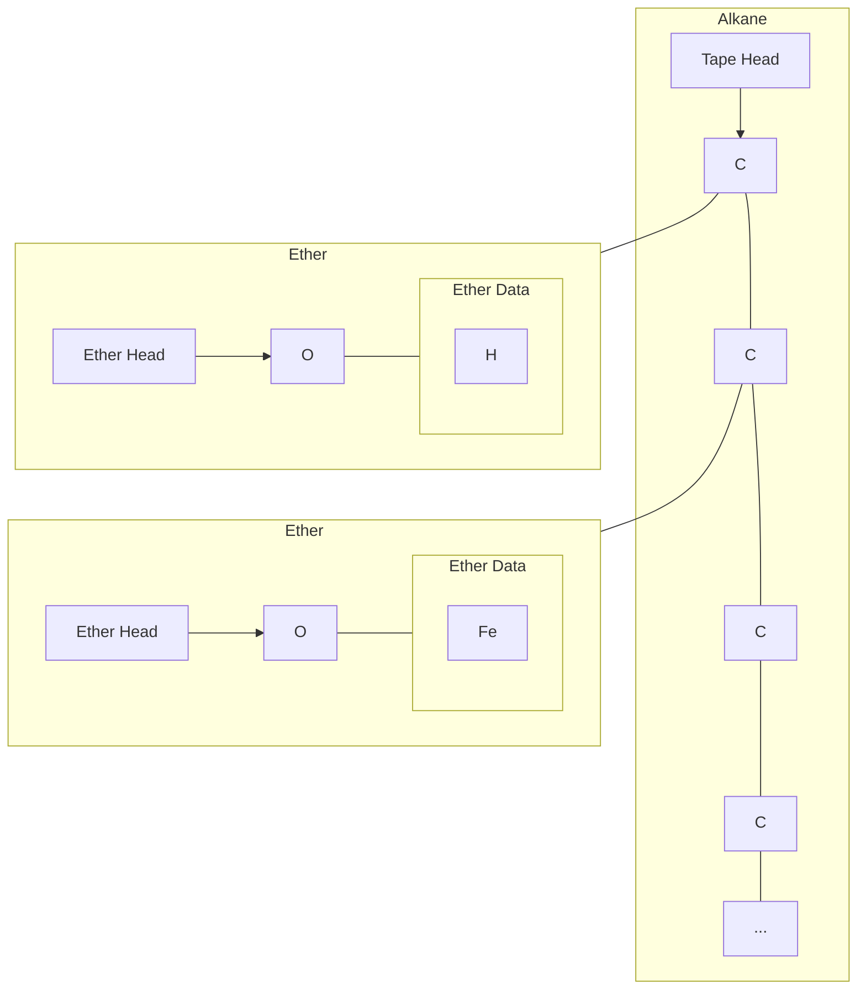

# Architecture

## Functional Groups

All functional groups should be represented as a tree.

All functional groups know their "head" atom, where traversal will begin.

## General structure

The main tape, at the tape-level, looks like this:

## Alkanes

Alkanes are a subclass of functional groups.
They specifically have helper methods that make it more convenient
to traverse and modify.