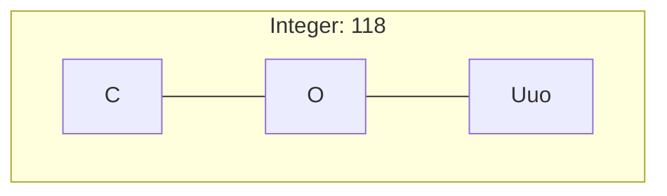
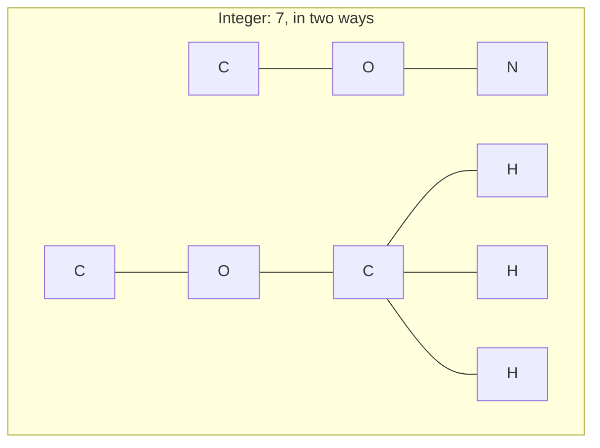
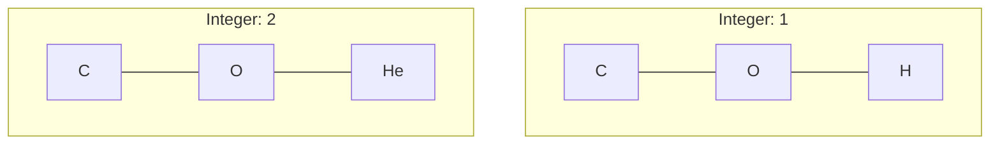
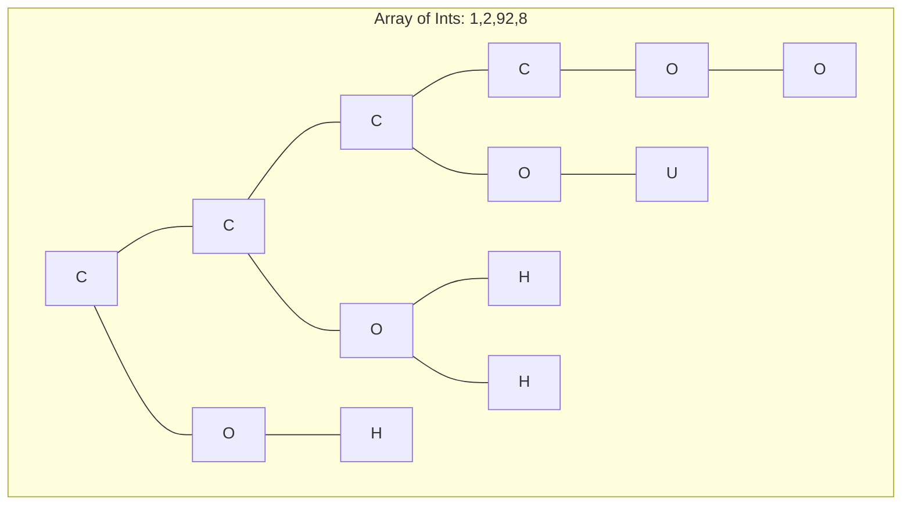
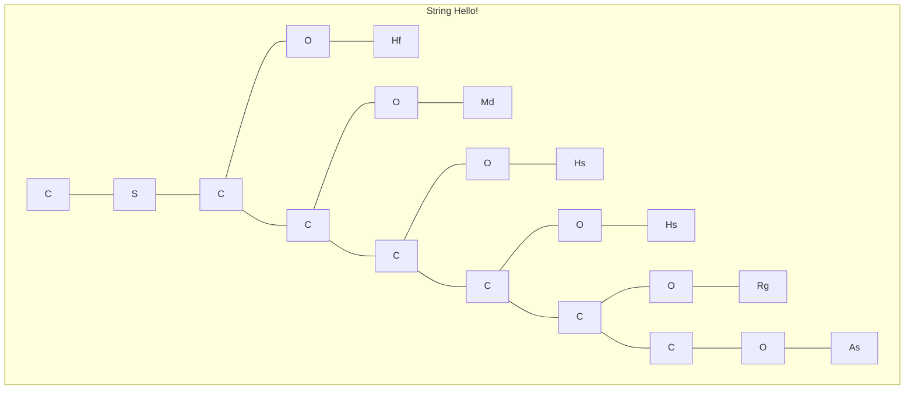

# Functional Group Examples

"Empty" hydrogens are not shown.









```mermaid
graph TB
subgraph map1 [Map of Int-Bool: 1:true,2:false,92:false,8:true]
cm0 --- nm0[N] --- om0[O] --- hm0[H] %% 1:true
nm0[N] --- bm0[B] --- boh0[OH] & bh0[C]
cm1 --- nm1[N] --- om1[O] --- hm1[He] %% 2:false
nm1[N] --- bm1[B] --- boh1[OH] & bh1[H]
cm2 --- nm2[N] --- om2[O] --- um2[U] %% 92:false
nm2[N] --- bm2[B] --- boh2[OH] & bh2[H]
nm3[N] --- om3[O] --- om32[O] %% 8:true
cm3 --- nm3[N] --- bm3[B] --- boh3[OH] & bh3[He]
cm0[C] --- cm1[C] --- cm2[C] --- cm3[C] %% main chain
end
```

